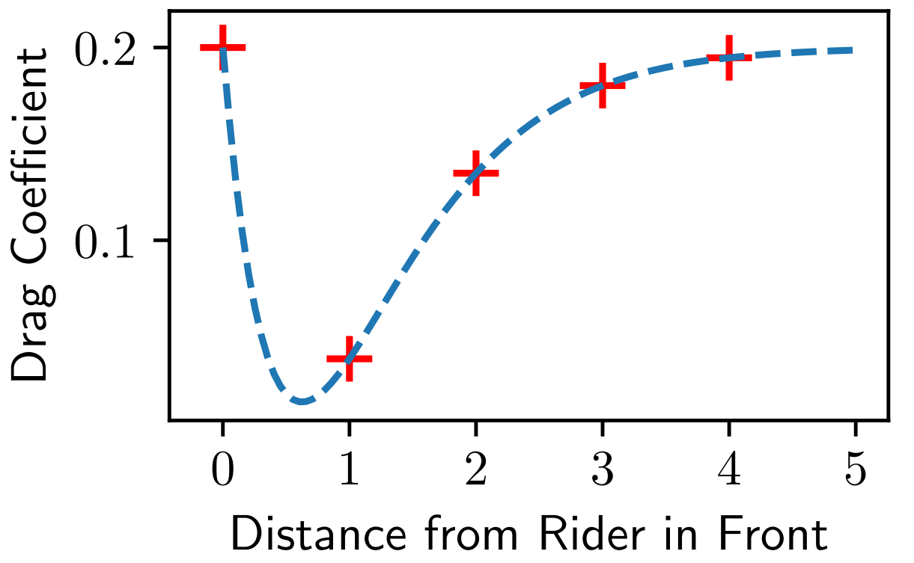
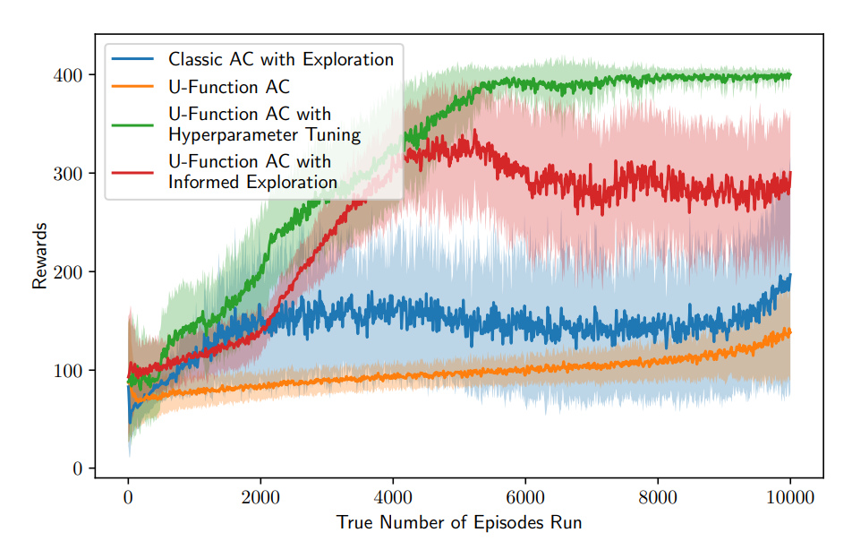

# Multi-Agent Reinforcement Learning with a Coach

This is my dissertation project (done in 2020), for which the aim was to investigate techniques for cooperative multi-agent reinforcement learning in a simple problem setting.

The dissertation itself is in `report/final-report.pdf`.

The code on this branch is the final approach settled on. Some of the other approaches tested are on the `all-approaches` branch.

## Installation

The project can be setup with poetry, but running `poetry install`. You are advised to do this starting from a new virtual environment, with only `poetry` installed. 

The main entrypoint for the code is in `src/main.py`.

## Environment

The environment simulates cyclists in a 1d race. The aim is to travel as far as possible in a set number of time steps. Agents have finite energy, and can conserve energy by cycling as close to possible to the rider in front (simulating a slip-streaming effect).

### State Space

The state of each cyclist is defined by:
* Their position (an integer)
* Their velocity (also an integer)
* Their energy (a positive float)
* The relative position of each other cyclist (an integer, positive if the other cyclist is in front)
* The relative velocity of each other cyclist (an integer, positive if the other cyclist is faster)
* The energy of each other cyclist

These values are all concatenated into a vector - of size $3n$ if $n$ is the total number of cyclists.

### Action Space

At each time step, a cyclist outputs an integer in the range $[0,2]$, with:
* 0 => the cyclist will reduce its velocity by 1
* 1 => the cyclist's velocity will stay the same
* 2 => the cyclist will increase its velocity by 1

### Rewards

The reward for a step in an episode is the distance travelled in that step, which is the sum of the velocities of the agents.

### Dynamics

At each time step, each cyclist moves forward by their velocity $v$ at that time. 

Their energy is also decreased by $v^3$, multiplied by a drag coefficient: $c_D$. $c_D$ is modelled as $k\min{[(1 - a(x+o)/e^{(b(x+o))}), 1]}$ where:
* $k$, $a$ and $b$ are positive constants defining the curve shape
* $o$ is a constant representing the ideal distance to be from the rider in front
* $x$ is the distance from the rider in front

The image below shows an example of the curve:

The drag coefficient as a function of distance from the closest rider in front. Agents benefit from staying in a pack, cycling just behind the closest cyclist in front.

### Stopping Condition

An episode ends either when:
* The number of steps for the episode is over
* Any of the cyclists has run out of energy

## Algorithm

The algorithm is an implementation of the Actor Critic algorithm with a Coach framework for dynamically optimising the reward function. 

Each agent learns its own policy and value function over the course of a number of episodes.

Instead of learning a single agent value function, we learn a multi-agent U-Function, which represents:

&space;=&space;\mathbb{E}\left[\sum_t&space;r_t&space;\middle|&space;s&space;=&space;s,&space;\bar{a}&space;=&space;\bar{a}\right]),

where  represents the actions of all of the agents apart from one partiular agent. This is to deal with non-stationarity in the multi-agent environment with respect to the varying policies of the other agents.

### The Coach

The coach (also refered to as a supervisor) oversees learning and tries to optimise hyperparameters. In this case there are two hyperparameters:

* The exploitation parameter
* The distance penalty, which adds a penalty to the reward function when cyclists are far apart

The coach always runs two simulations in parallel with different hyperparameter values. Based on which simulation lead to more learning for the agents, the coach learns which hyperparameters to set for the next simulations. The search algorithm for the best hyperparameters is a relatively simple exponential search algorithm (described further in the report).

At the end of each set of simulations, the policy and value function of the best performing agent is shared across all of the agents. The value function is also updated with off policy learning, based on the experience of the agents in the other set of simulations. 

The final results are shown below:

The results are explained in more detail in the report, but the final algorithm (shown in green) leads to considerably faster learning when compared to other approaches.

